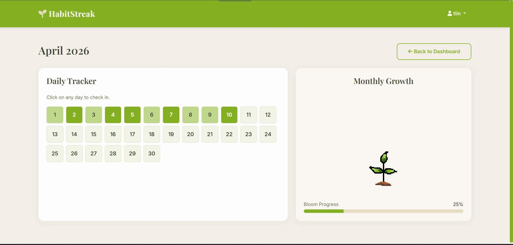

# HabitStreak 
> *Gamify your consistency and watch your progress grow*



HabitStreak is a full-stack habit tracking web application designed to empower users to build, monitor, and maintain productive daily routines. Just log your daily check-ins and the app automatically translates your consistency into a flourishing virtual tree.

---

## How It Works

When you create a habit, the backend utilizes Django's ORM to securely store your goals in a MySQL database. Daily tracking is handled asynchronously via custom jQuery AJAX requests, allowing you to check off or "skip" habits for the day without reloading the page. 

Behind the scenes, the Django views calculate your monthly completion percentage and dynamically map that data to specific visual growth stages of a virtual tree and a calendar heatmap, offering immediate, gamified feedback.

---

## Tech Stack

* **Frontend:** HTML5, CSS3, Bootstrap 5
* **Backend:** Django, Python
* **Database:** MySQL & Django ORM
* **Interactivity:** jQuery, AJAX
* **Security:** Django Session Middleware, CSRF Protection

---

## Features

- **Gamified Analytics**: A dynamic calendar heatmap and interactive tree-growth visualization that evolves based on your monthly completion rate.
- **Asynchronous Daily Check-ins**: Mark habits as complete in real-time using jQuery/AJAX without full page reloads.
- **Soft-Deletion (Skip Logic)**: Seamlessly "skip" a habit for the day (utilizing an `is_hidden` boolean) without destroying historical data or breaking your streak.
- **Real-Time Search**: Instantly filter your list of active habits using client-side DOM manipulation.
- **Secure Authentication**: Built-in user registration, secure session cookies, and personalized dashboards.

---

## Project Structure

```text
habit-tracker/
└── habitstreak/
    ├── habits/                  # Main Django App
    │   ├── migrations/          # Database migrations
    │   ├── static/              # CSS, JS, and Images (e.g., animated_sapling.gif)
    │   ├── templates/habits/    # Frontend HTML templates
    │   │   ├── add_habit.html
    │   │   ├── base.html        # Global layout and UI theme
    │   │   ├── daily_checkin.html
    │   │   ├── dashboard.html
    │   │   ├── delete_habit.html
    │   │   ├── home.html
    │   │   ├── login.html
    │   │   ├── manage_habits.html
    │   │   ├── month_view.html  # Heatmap & Tree rendering
    │   │   └── register.html
    │   ├── admin.py
    │   ├── apps.py
    │   ├── forms.py             # Server-side validation
    │   ├── models.py            # Database schema (Habit, CheckIn)
    │   ├── urls.py              # App-level routing
    │   └── views.py             # Core business logic and streak math
    ├── habitstreak/             # Project config directory
    ├── manage.py                # Django CLI utility
    └── venv/                    # Virtual environment
```

---

## Getting Started

### Prerequisites

- Python 3.12+
- MySQL (or SQLite for local testing)

### Local Setup

```bash
# Clone the repository and enter the directory
cd habit-tracker/habitstreak

# Activate your virtual environment
source venv/Scripts/activate  # On Windows

# Install Python dependencies
pip install -r requirements.txt

# Apply database migrations
python manage.py makemigrations
python manage.py migrate

# Start the development server
python manage.py runserver
```

The app will be available at `http://127.0.0.1:8000/`.

---

## Core Architecture Highlights

### The Soft-Delete Logic
Instead of permanently deleting a record when a user skips a habit, the `CheckIn` model utilizes a day-specific temporal boolean:
```python
is_hidden = models.BooleanField(default=False)
```
This allows the UI to hide the habit for that specific calendar date while preserving the user's historical data and ensuring the habit safely returns the next day.

### AJAX Integration
The application utilizes a custom REST-like architecture for dynamic updates:
* **POST `/checkin/toggle/`** — Asynchronously toggles a habit's completion state.
* **POST `/checkin/skip/`** — Triggers the soft-delete visibility flag.

---

## Dependencies

### Python (`requirements.txt`)
```text
asgiref==3.11.1
Django==6.0.4
mysqlclient==2.2.8
pip==25.0.1
python-dotenv==1.2.2
sqlparse==0.5.5
tzdata==2026.1
```

---

## Assets & Rights

All custom animations, including the **Growth Sapling GIF**, were designed and created specifically for this project.
* **Format:** Hand-crafted pixel/frame-based animation.
* **Rights:** © 2026 tiin-tiin. All rights reserved. 
* *Note: These assets are intended for the HabitStreak project and should not be redistributed without permission.*
